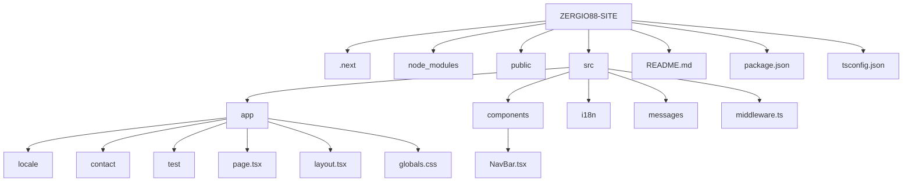

## 1. zergio88-site 

Personal website created with Next.js, React, and Tailwind CSS. Currently in the initial layout stage, it will be the portfolio where I'll showcase my projects, experience, and contact information.

### 2. Technology Stack

Technologies:<br>
&nbsp;&nbsp;<br>
&nbsp;&nbsp;<br>
&nbsp;&nbsp;<br>
&nbsp;&nbsp;<br>
&nbsp;&nbsp;<br>
&nbsp;&nbsp;<br>
&nbsp;&nbsp;<br>

### 3. Folder structure





### 4. How to run the project locally

##### 🚀 Installation and execution

```bash
# Clone the repository
git clone https://github.com/Zergio88/zergio88-site.git

# Enter the project
cd zergio88-site

# Install dependencies
npm install

# Run in development
npm run dev

### 5. Link to the Vercel site

🌍 **Visit the live site:** [zergio88.site](https://zergio88.site)
